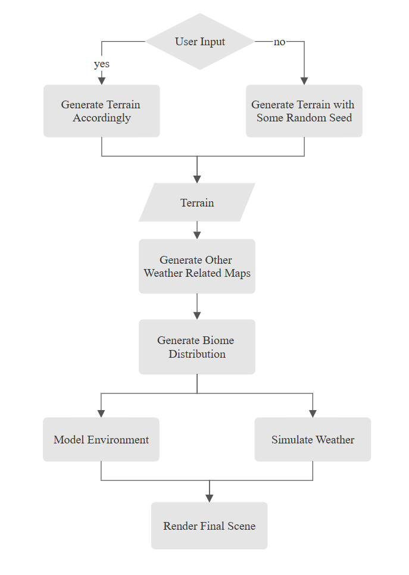

### Design Doc

#### Introduction
The project stems from a fascination with procedural weather systems discovered during a past internship. Procedurally generated weather responds to factors like terrain height, temperature, and humidity, which offers the exciting potential to create realistic, responsive environments that enhance immersion in virtual worlds, whether in games, simulations, or educational tools. By building a system that can handle weather generation at both macro and micro levels, we aim to provide an experience that not only enhances the sense of realism but also invites users to engage with the environment through exploration and experimentation.

#### Goal
The final outcome of our project is to produce a fully procedural-generated and self-evolving weather system based on some user inputs, like height maps or other distribution maps. Also, the project should provide the users with some additional tunable parameters to change the generated environment and allow user to zoom in/out to view the simulated result on both micro and marco levels.

#### Inspiration/reference:

- Geographical Adventures
  
||
|:--:|
|*[Geographical Adventures by Sebastian Lagu](https://github.com/SebLague/Geographical-Adventures)*|

This little geography game resembles what we hope to achieve for our macro scopic simulation, both visually and logically. We hope to draw inspiration from how Sebastian used real world geography data to simulate weather.

- Procedural Weather Patterns
  
||
|:--:|
|*[Procedural Weather Patterns by Nick](https://nickmcd.me/2018/07/10/procedural-weather-patterns/)*|

Our project was inspired by Nick's blog post, where they discussed how to procedrually generate dynamic weather. Although our project will likely be at a bigger scope, we will definitely refer to their discussion on procedurally generating weather maps (like precipitation map, wind map etc.).

#### Specification:
- Our project should be able to generate terrain and other required maps either automatically by some random seed or by reading some user provided maps.
- The system should provide some intuitive parameters for users to adjust the weather as they like.
- The modeled environment should be presented in a certain levels of details that allow user to zoom in or out for viewing.

#### Techniques:
- Noise functions will be involved in process of terrain, other related maps and cloud/rain generation.
- For the map generation part, we think this [article](https://medium.com/@henchman/adventures-in-procedural-terrain-generation-part-1-b64c29e2367a) and [this repository](https://github.com/weigert/proceduralweather) might be useful.
- For the weather transition and how different variable might act on one another, we might refer to [this paper](http://www.ignaciogarciadorado.com/p/2017_TOG/2017_TOG.pdf) as well.
- For the rendering part, we might refer to the [GDC talk](https://www.youtube.com/watch?v=mGHCOOnI5aE).

#### Design:

#### Timeline:
- The focus of Milestone 1 would be mainly about generating terrain and other required map for weather.
- The focus of Milestone 2 would be mainly about simualting the weather and environment modeling.
- The focus of Milestone 3 would be mainly about rendering the weather and creating the special effects for the weather.

|*Timeline*|*Tasks for Christine*|*Tasks for Hanting*|
|:--:|:--:|:--:|
|Week 1 (2024/11/06 to 2024/11/13)|Procedural terrain generation|Water Map generation|
||Height map generation|Cloud map generation|
|||Temperature map generation|
|Week 2 (2024/11/13 to 2024/11/20)|Vegetation and environment modeling|Weather transition|
|Week 3 (2024/11/20 to 2024/11/27)|Environmental assets displacement|Water and terrain shader design|
|Week 4 (2024/11/27 to 2024/12/02)| Design the cloud shader|Rain shader design|
||Snow shader design if time allowed|Wet effect design if time allowed|

## Milestone 1

In Milestone 1, we laid the groundwork for our weather simulation project by generating both terrain and weather maps. These foundational maps allowed us to create a basic macroscopic view of our planet, incorporating a high level of user control for customization. 

||
|:--:|
|*Milestone 1 Demo*|

### Completed Tasks

#### Height Map & Procedural Terrain Generation (Christine)

- **Planet Shape**

I used a cube with six faces, which is dynamically displaced into a unit sphere. The terrain is triangulated based on user input, allowing control over both tessellation levels and radius adjustments via the editor. The basic sphere is then further displaced by sampling the height map generated in the following step.

||||
|:--:|:--:|:--:|
|*LOD*|*Radius*|*User Conrtol*|

- **Procedural Terrain Generation & Height Map**

Users can add custom noise layers, with each layer introducing additional surface variation to the planet. Using Perlin noise, users have control over parameters such as number of layers, frequency, base roughness, roughness, minimum value, and strength. 

||||
|:--:|:--:|:--:|
|*Noise*|*Height Map*|*User Control*|

The first noise layer can act as a mask to define continent outlines, for example. Subsequent layers, like a second noise layer, can add high-strength noise to simulate mountainous regions. Using the first layer as a mask allows us to ensure that mountains only appear on continents rather than oceans, as demonstrated below.

||||
|:--:|:--:|:--:|
|*First Layer*|*First + Second Layer*|*First + Second Layer (using first layer as mask)*|

#### Other Weather Maps (Hanting)

- **Water Map**

Water map is generated based on the the height map. The user can adjust the percentage of water coverage of planet based on height with Water Ratio slider.

|||
|:--:|:--:|
|*Water Map*|*User Control*|

- **Cloud Map**

Cloud map is purely randomly generated by the perlin noise in the initialization stage. The user can change the number of the storm centers they want to have by sliding the Center Number slider. To have the swirling clouds on the atmosphere, I use the curl noise for cloud flow decribed in this [article](https://www.cs.ubc.ca/~rbridson/docs/bridson-siggraph2007-curlnoise.pdf). 

|||
|:--:|:--:|
|*Cloud Map*|*User Control*|

- **Temperature Map**

Tempurature map is generated based the latitude and height of the globe. In this Setting, the temperature tends to be lower at both poles and places of high altitude, and gets warmer as becomes closer to the equator. People can slide the Latitude Weight and Height Weight to adjust the influence of these two factors acting on temperature.

|||
|:--:|:--:|
|*Temperature Map*|*User Control*|

#### References
- [*Sebastian Lague's Procedural Planet Series*](https://www.youtube.com/watch?v=QN39W020LqU&list=PLFt_AvWsXl0cONs3T0By4puYy6GM22ko8)
- [*Curl Noise*](https://www.cs.ubc.ca/~rbridson/docs/bridson-siggraph2007-curlnoise.pdf)

## Milestone 2

### Completed Tasks

#### Biome Map Generation & Microscopic Cloud Generation (Hanting)

- **Biome Map Generation**
Biome map is generated based on two maps temperature map and humidity map. User can provide a texture map that assigns different colors that represents different biomes. The provided texture should take temperature in y-axis and humidity in x-axis, like the picture shown below.

|||
|:--:|:--:|
|*Biome Map*|*Planet textured by Biome Map*|

- **Microscopic Cloud Generation**
  
Our volumetric clouds are generated through sampling the density of a provided 3D noise texture by raymarching, so that in the final version, the player can move around or in the cloud. To do that, this [video](https://www.youtube.com/watch?v=4QOcCGI6xOU) provide great help to me. Currently, the clouds are only rendered in a fixed box and didn't sample the cloud map distribution. I'll continue to work on that in the final version.

||
|:--:|
|*Cloud*|

#### Procedural Weather & Weather Visualization (Christine)

- **Procedural Weather**
  
I leverage our maps including temperature, water, and cloud maps to procedurally generate realistic and dynamic weather conditions. 
Each map is associated with an environmental factor that influence the weather:

|**Map**|**Environmental Factor**|
|:--:|:--:|
|Temperature Map|Temperature|
|Water Map|Water Proximity|
|Cloud Map|Cloud Density|

By integrating environmental factors, I simulate the following weather phenomena based on user-defined thresholds:

|**Weather Type**|**Relevant Environmental Factor**|
|:--:|:--:|
|Sunny|*temperature > hotThreshold && cloudDensity < lowThreshold*|
|Rainy|*temperature > coldThreshold && cloudDensity > highThreshold && waterProximity > nearThreshold*|
|Cloudy|*cloudDensity > mediumThreshold*|
|Snowy|*temperature < coldThreshold && cloudDensity > highThreshold && waterProximity > nearThreshold*|
|Partly Cloudy|*Other*|

Additionally, each weather type is assigned an intensity based on the current environmental factors and some smoothing factor.

|||
|:--:|:--:|
|*Weather Map (R Channel: Weather Type, G Channel: Intensity)*|*User Control*|

- **Weather Visualization**

I also created a shader to showcase our dyanmic weather system, where each color represents a unique weather type.

|||
|:--:|:--:|
|*Weather Map Visualization*|*User Control*|

#### References
- [*Sebastian Lague's Coding Adventure: Clouds*](https://www.youtube.com/watch?v=4QOcCGI6xOU)

## Final submission (due 12/2)
Time to polish! Spen this last week of your project using your generator to produce beautiful output. Add textures, tune parameters, play with colors, play with camera animation. Take the feedback from class critques and use it to take your project to the next level.

Submission:
- Push all your code / files to your repository
- Come to class ready to present your finished project
- Update your README with two sections 
  - final results with images and a live demo if possible
  - post mortem: how did your project go overall? Did you accomplish your goals? Did you have to pivot?

## Topic Suggestions

### Create a generator in Houdini

### A CLASSIC 4K DEMO
- In the spirit of the demo scene, create an animation that fits into a 4k executable that runs in real-time. Feel free to take inspiration from the many existing demos. Focus on efficiency and elegance in your implementation.
- Example: 
  - [cdak by Quite & orange](https://www.youtube.com/watch?v=RCh3Q08HMfs&list=PLA5E2FF8E143DA58C)

### A RE-IMPLEMENTATION
- Take an academic paper or other pre-existing project and implement it, or a portion of it.
- Examples:
  - [2D Wavefunction Collapse Pokémon Town](https://gurtd.github.io/566-final-project/)
  - [3D Wavefunction Collapse Dungeon Generator](https://github.com/whaoran0718/3dDungeonGeneration)
  - [Reaction Diffusion](https://github.com/charlesliwang/Reaction-Diffusion)
  - [WebGL Erosion](https://github.com/LanLou123/Webgl-Erosion)
  - [Particle Waterfall](https://github.com/chloele33/particle-waterfall)
  - [Voxelized Bread](https://github.com/ChiantiYZY/566-final)

### A FORGERY
Taking inspiration from a particular natural phenomenon or distinctive set of visuals, implement a detailed, procedural recreation of that aesthetic. This includes modeling, texturing and object placement within your scene. Does not need to be real-time. Focus on detail and visual accuracy in your implementation.
- Examples:
  - [The Shrines](https://github.com/byumjin/The-Shrines)
  - [Watercolor Shader](https://github.com/gracelgilbert/watercolor-stylization)
  - [Sunset Beach](https://github.com/HanmingZhang/homework-final)
  - [Sky Whales](https://github.com/WanruZhao/CIS566FinalProject)
  - [Snail](https://www.shadertoy.com/view/ld3Gz2)
  - [Journey](https://www.shadertoy.com/view/ldlcRf)
  - [Big Hero 6 Wormhole](https://2.bp.blogspot.com/-R-6AN2cWjwg/VTyIzIQSQfI/AAAAAAAABLA/GC0yzzz4wHw/s1600/big-hero-6-disneyscreencaps.com-10092.jpg)

### A GAME LEVEL
- Like generations of game makers before us, create a game which generates an navigable environment (eg. a roguelike dungeon, platforms) and some sort of goal or conflict (eg. enemy agents to avoid or items to collect). Aim to create an experience that will challenge players and vary noticeably in different playthroughs, whether that means procedural dungeon generation, careful resource management or an interesting AI model. Focus on designing a system that is capable of generating complex challenges and goals.
- Examples:
  - [Rhythm-based Mario Platformer](https://github.com/sgalban/platformer-gen-2D)
  - [Pokémon Ice Puzzle Generator](https://github.com/jwang5675/Ice-Puzzle-Generator)
  - [Abstract Exploratory Game](https://github.com/MauKMu/procedural-final-project)
  - [Tiny Wings](https://github.com/irovira/TinyWings)
  - Spore
  - Dwarf Fortress
  - Minecraft
  - Rogue

### AN ANIMATED ENVIRONMENT / MUSIC VISUALIZER
- Create an environment full of interactive procedural animation. The goal of this project is to create an environment that feels responsive and alive. Whether or not animations are musically-driven, sound should be an important component. Focus on user interactions, motion design and experimental interfaces.
- Examples:
  - [The Darkside](https://github.com/morganherrmann/thedarkside)
  - [Music Visualizer](https://yuruwang.github.io/MusicVisualizer/)
  - [Abstract Mesh Animation](https://github.com/mgriley/cis566_finalproj)
  - [Panoramical](https://www.youtube.com/watch?v=gBTTMNFXHTk)
  - [Bound](https://www.youtube.com/watch?v=aE37l6RvF-c)

### YOUR OWN PROPOSAL
- You are of course welcome to propose your own topic . Regardless of what you choose, you and your team must research your topic and relevant techniques and come up with a detailed plan of execution. You will meet with some subset of the procedural staff before starting implementation for approval.
